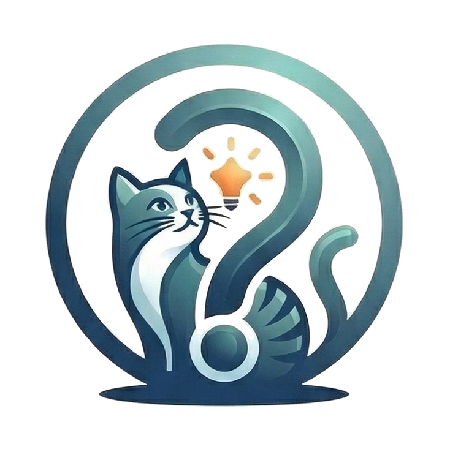

#  Curiosillo

[](https://www.android.com)
[](https://developer.android.com/jetpack/compose)
[](https://deepmind.google/technologies/gemini/)

**Curiosillo** is an Android edutainment app designed to make learning a daily habit—fun, effortless, and bite-sized. Explore wonders across science, history, nature, technology, and more.

---

## ✨ Features

Curiosillo offers a rich set of features to keep your curiosity sparked:

* **📅 Daily Curiosities:** Discover a new fact every day, tailored to your favorite categories.
* **🧠 AI Deep Dive:** Ask **Curiosillo** to expand on any curiosity with extra context and anecdotes.
* **⚔️ Duels:** Challenge other users in real-time multiple-choice quiz battles.
* **🔥 Gamification:** Stay motivated with daily streaks, flame indicators, and a points system.
* **📚 Review Mode:** Revisit previously read curiosities using time-based filters.
* **📝 Bookmarks & Notes:** Save your favorites and attach personal reflections.
* **💬 Community:** Engage with other users through the integrated comments system.
* **🛡️ Admin & Reporting:** Flag inaccurate content for moderation and then the admins will procede to edit them.

---

## 🛠️ Tech Stack

The app is built using modern Android development best practices:

| Layer | Technology                          |
| :--- |:------------------------------------|
| **UI Framework** | Jetpack Compose + Material 3        |
| **Architecture** | MVVM + StateFlow                    |
| **Local Database** | Room                                |
| **Backend** | Firebase (Auth, Firestore, Storage) |
| **AI Engine** | Google Gemini 2.5 Flash lite        |
| **Navigation** | Navigation Compose                  |
| **Image Loading** | Coil                                |
| **Build System** | Kotlin DSL + KSP                    |

---

## 📂 Project Structure

The codebase follows a clean separation of concerns:

```text
app/src/main/java/com/example/curiosillo/
├── 📦 data          # Data models and Room database configuration
├── ⚙️ domain        # Business logic and gamification engine
├── 🧱 firebase      # FirebaseManager and cloud integration
├── 🗄️ repository    # Data source management (CuriosityRepository)
├── 🎨 ui            # Composable screens and UI components
└── 📱 viewmodel     # UI state management
```
---
## 📄 License
This project is currently private. All rights reserved.